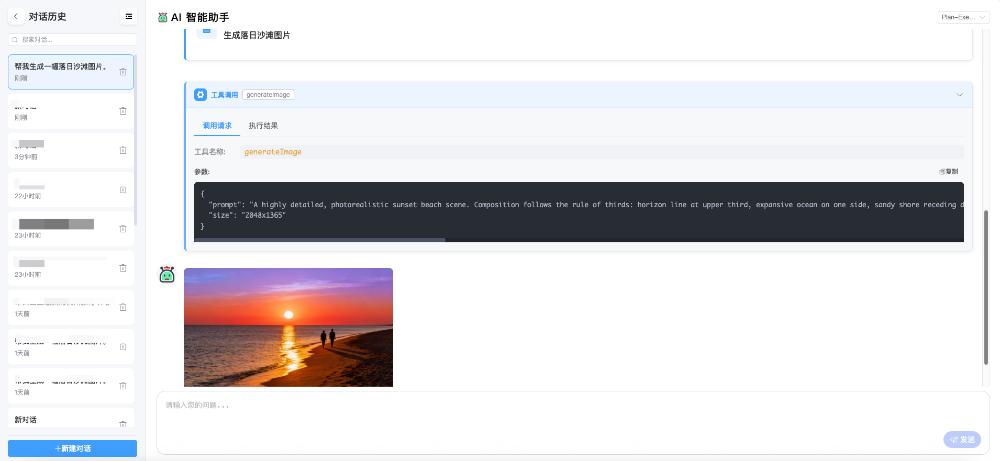
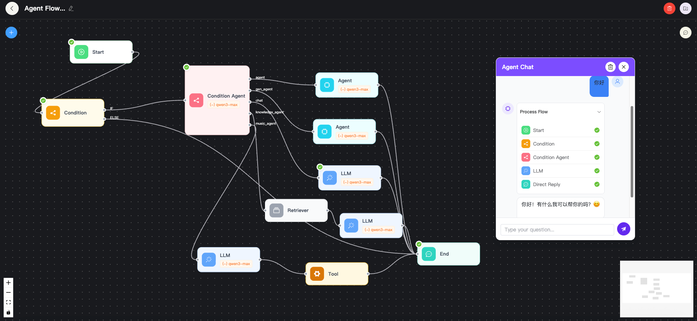
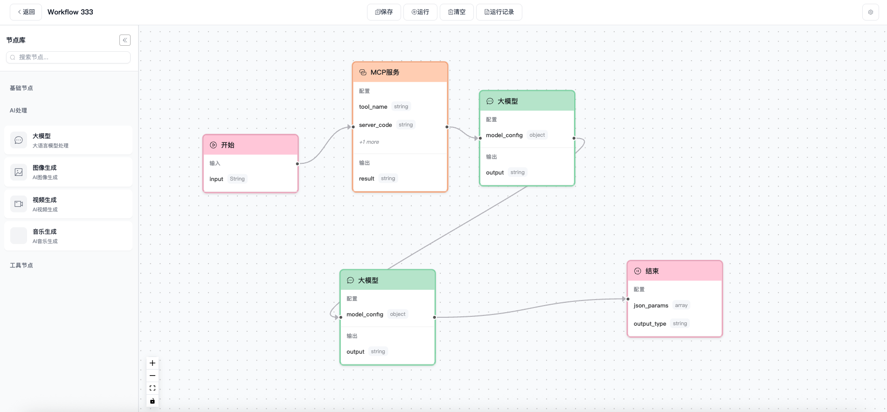

# Coding-AI

一个基于 **Spring Boot 3 + Spring AI + Vue 3** 的 AI 应用/工作流平台。


## 1. 核心特性

- 可视化节点拖拽编排

- 实现 `React Agent` 和 `Plan - Execute Agent` 

- 支持知识库 `RAG` 嵌入


## 2. 界面展示
> 支持React Agent和Plan - Execute Agent两种模式的对话



> 可视化节点编排智能体(自主决策)



> 可视化节点编排工作流(固定流程)




## 2. 目录结构

```
Coding-AI/
├── coding-ai-backend/        # 后端服务
├── coding-ai-graph-core/     # 图执行依赖库
├── coding-ai-frontend/       # 前端服务
└── pom.xml                   
```


##  3. 环境依赖

> 后端：JDK 17、MySQL、PostgreSQL(PGVector)、Redis

### **3.1 初始化表结构**

> MySQL表结构

`coding-ai-backend/sql/mysql-table.sql`

> PGVector表结构

`coding-ai-backend/sql/pgvector-table.sql`

### 3.2 准备 AI 服务密钥

> **配置文件**：`coding-ai-backend/src/main/resources/ai-service-config.yaml`

- **阿里百炼**：https://bailian.console.aliyun.com/#/api-key
- **火山引擎**：https://console.volcengine.com/ark/region:ark+cn-beijing/apiKey
- **MiniMax**：https://platform.minimaxi.com/user-center/basic-information/interface-key

